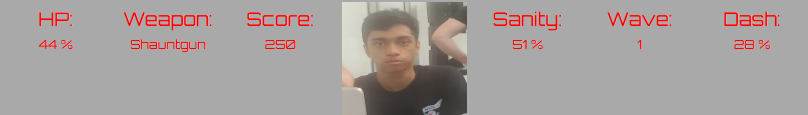

# Shanvanth's Last Stand

## Getting started

### Installation

1. Click [here](https://github.com/Imeanbusiness/Shan-s-Last-Stand/archive/refs/heads/main.zip) to download. The current version is `v1.2.1`, code name `Marina`.

2. Unzip the folder

3. Uncompress the folder

4. Open the folder and open index.html

## Basics 

### Player HUD

### 1: HP

This is your health. Every time an enemy hits you, it gets reduced. You can pickup Shaunulators to heal back up. Once it hits 0, the game is over

### 2: Weapon

Shows the current weapon you have equipped. Press 1 to equip the Shauntgun, a close range high damge single shot shotgun, and 2 for the Shauniper, a long rage high damage weapon.

### 3: Score

Shows your current score. For every enemy you kill, your score is incresed. The higher your score, the better.

### 4: Shanvanth Image

Depending on your sanity, Shanvanth will change from going insane, to normal, to happy.

### 5: Sanity

Firing weapons costs sanity. Sanity also affects how much damage each weapon does. If your sanity hits 0, you will not be able to fire your weapons and must regain it through waiting, Shaunulators, or math problems. 

### 6: Wave

The wave increases every 2500 score. Enemies get tougher, and tougher enemies start spawning.

### 7: Dash

Shows when you are ready to Dash again at 100%. Press shift to dash.

