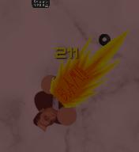
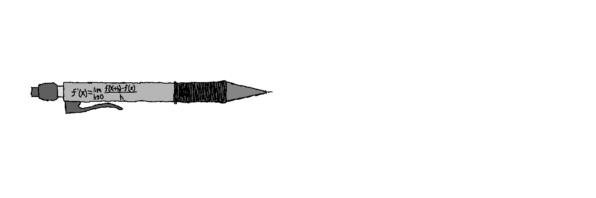
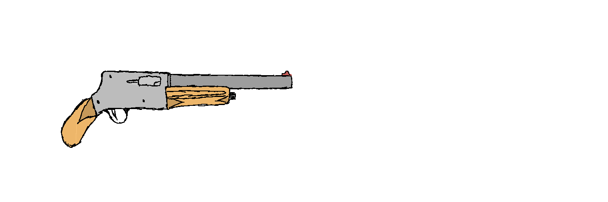
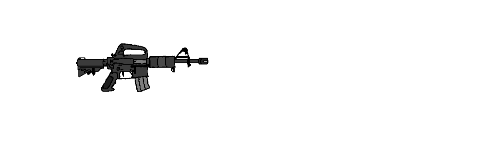

# Shanvanth's Last Stand

## Getting started

### Minimum Specs

- GPU: Nvidia GeForce GT 730

- CPU: Intel Core i3-4130

- RAM: 4GB

It'll run *OKAY*, a little choppy but still playable.

### Recommended Specs

- GPU: Nvidia GeForce MX 110

- CPU: Intel Core i5-4460

- RAM: 8GB

Pretty consistent 60fps, hopefully.

### Installation

1. Click [here](https://github.com/Imeanbusiness/Shan-s-Last-Stand/archive/refs/heads/main.zip) to download. You can play online [here](https://imeanbusiness.github.io/Shan-s-Last-Stand/) on my github domain or [here](https://scraftyimb.itch.io/shans-last-stand) on itch.io.

2. Unzip the folder (if you downloaded it)

3. Uncompress the folder

4. Open the folder and open index.html

## Basics 

### Player HUD

### 1: HP

This is your health. Every time an enemy hits you, it gets reduced. You can pickup Shaunulators to heal back up. Once it hits 0, the game is over

### 2: Weapon

Shows the current weapon you have equipped. Press __1__ to equip the Shauntgun, a close range medium damge single shot shotgun, __2__ for the Shauniper, a long rage single shot high damage weapon, __2__ for the Asshaunt Rifle, a medium range high DPS automatic rifle, and __c__ for the M. Pencil, a melee weapon that helps you regain sanity.

### 3: Ammo

Shows how many shots you have left. The different weapons all use sanity (except the M. Pencil), though each one uses different amounts. Use this to manage your ammo.

### 4: Shanvanth Image

Depending on your sanity, Shanvanth will change from going insane, to normal, to happy.

### 5: Sanity

Firing weapons costs sanity. Sanity also affects how much damage each weapon does. If your sanity hits 0, you will not be able to fire your weapons and must regain it through waiting, Shaunulators, or meleeing with the M. Pencil. 

### 6: Wave

The wave increases every 2500 score. Enemies get tougher, and tougher enemies start spawning. In Campaign, this shows your level. The higher your level, the more damage you do, and the more health you have.

### 7: Score

Shows your current score. For every enemy you kill, your score is incresed. The higher your score, the better. In campaign, this shows your XP. Your level increases when you hit the XP cap.

### Gameplay

### Moving

Use __WASD or Arrow Keys__ (imagine) to move. Use your __mouse cursor__ to aim your weapons. Press __shift__ to dash, becoming temporarily immune to all attacks and moving much faster.

### Attacking

On __desktop__, press the __spacebar__ or __click__ to attack. Different weapons have different damage values. A number will pop up, showing how much damage you did. If you deal enough damage to an enemy, they will die. You can switch weapons using the __number keys__, or __c__ for the mechanical pencil. Press __shift__ to dash. 

On __mobile__, use the __left joystick__ to move, and the __the right joystick to aim__. Press the __attack button__ to attack. It has the explosion on it. Press __Switch Button__ to cycle between your weapons. Press __Pencil Button__ to switch to the mechanical pencil. Press __Dash Button__ to dash. It has a lightning symbol on it.

### Surviving 

Enemies deal damage on contact, or through the projectiles that they hurl at you. Dodge them and kill them as fast as you can. As soon as your HP hits 0, you die. and lose the game. So try not to!

## Weapons

Note: All stats assume you are in "Derivatives are doable..." difficulty, the normal difficulty, at level 1 with 50% sanity.

- Hotkey: Button to switch to weapon.

- Sanity Usage: How much sanity the weapon uses up per shot.

- Base Damage: The regular amount of damage the weapon would deal with NO modifiers.

- Weapon Ready Time: This is how long the weapon takes to ready when you first switch to it. This will be in **ms**

- Weapon Fire Rate: How many times per minute (approximately, 2 decimal places) the weapon can be fired. This will be in **RPM**.

- Base DPS: How much damage per second the weapon would deal with NO modifiers.

- Range: A *rough* idea of the range of the weapon.

- Description: Some lore, some tactics, some mechanic stuff. Important things will be in **bold**.

### Mechanical Pencil

- Hotkey: **c**

- Sanity Usage: N/A

- Base Damage: 475

- Weapon Ready Time: 250 ms

- Weapon Fire Rate: 200 RPM (3.33 RPS)

- Base DPS: 1550

- Range: Melee

- Shanvanth's favourite pencil can be used to do calculus on anything, even people! This keeps him sane, so he always keeps the pencil on him. This weapon is a **melee** weapon that can be used to **regain 4 sanity**. The attacking speed is fast, but it can only hit a single target at a time. **Damage drops off when as your sanity increases.** Use this when you are really low on sanity!

### Shauntgun

- Hotkey: **1**

- Sanity Usage: 2%

- Base Damage: 900

- Weapon Ready Time: 250 ms

- Weapon Fire Rate: 54.55 RPM (0.90 RPS)

- Base DPS: 810

- Range: Short

- A beautiful shotgun given to Shanvanth by Joshua. This thing is a calculus slaying beast! This weapon is a **short ranged**, **single shot** weapon that uses **hitscan** to attack. This **medium damage** weapon is a good all rounder up close, handling multiple enemies at once with **piercing shots**. It's versatile, but it should not be used for anything other than **close to medium range**.

### Shauniper

- Hotkey: **2**

- Sanity Usage: 4%

- Base Damage: 1050

- Weapon Ready Time: 83 ms

- Weapon Fire Rate: 40 RPM (0.67 RPS)

- Base DPS: 700

- Range: Very Long

- The Shan-inator 72, also known as the Shauniper, is a powerful old rifle designed by Shanvanth himself! This thing is powered by a TI-84 plus, and can blow off integration problems from a mile away. This weapon is a **long ranged** weapon that uses **projectiles** to attack. This projectile is **100% accurate**. This **high damage** weapon is very good at picking off enemies on the other side of the map, and has the **highest damage single shot**. However, it is **very slow** with the **lowest DPS in the game**, and **takes a lot of sanity** to be fired. It only hits **one target**. Due to its low ready time, it is a great switch in weapon for combos, and a **good utility** weapon in general.

### Asshaunt Rifle

- Hotkey: **3**

- Sanity Usage: 1%

- Base Damage: 300

- Weapon Ready Time: 500 ms

- Weapon Fire Rate: 900 RPM (15 RPS)

- Base DPS: 4500

- Range: Very Long

- A heavy, problem slaying rifle with a dream to crush calculus. Shanvanth's assault rifle is great at shredding into defences. This weapon is a **long ranged** weapon that uses **projectiles** to attack. This **low damage** weapon makes up for its pathetic single shot damage with an **extremely fast fire rate**, having a **massive DPS** that can shred enemies very quickly. However, it has an **8° spread**, making it **inaccurate at farther ranges**. It also **chews through sanity insanely fast**, making it not worthwhile as a main weapon. It only hits **one target**. It also has the **slowest ready time** in the game. For these reasons, it should be used as a **medium ranged** destroyer for **tanky enemies**.

## Enemies

Note: All stats assume you are in "Derivatives are doable..." difficulty, the normal difficulty, at level 1 with 50% sanity.

- HP: The base health points of this enemy.

- Base Damage: The base damage of this enemy.

- Speed: How fast the enemy moves in PPS (Pixels per second). For reference, the map is 650 px by 650 px.

- Range: A *rough* idea of the enemy's attack range.

- Description: Some lore, some tactics, some mechanic stuff. Important things will be in **bold**.

### Dominic

- HP: 350.

- Base Damage: 4

- Speed: 120 PPS.

- Range: Melee

- Description: Me! Dominic chases Shanvath around relentlessly, harassing him and never letting him get away with is vicious speed. Dominic is **fast** and **spawns very often** dealing **low melee damage**, but has relatively **low health** and can be killed easily with all weapons. He can easily **swarm** you, so get rid of them as fast as you can!

### Cheng Feng

- HP: 250.

- Base Damage: 5

- Speed: 140 PPS.

- Range: 170 px

- Description: Cheng Feng seeks to remind Shanvanth of his failures by hurling burnt tires at him. Cheng Feng is **very fast** and **spanws often**, often there to support enemies in front of him. He deals **moderate ranged damage** and can attack you up close as well. It's best not to leave him at **medium** range and either pick on him up close or from far away. He has **very low health**, making him a good victim for the M. Pencil.

### Zuk

- HP: 700.

- Base Damage: 6

- Speed: 30 PPS.

- Range: Melee

- Description: Zuk wants to slam down on Shanvanth and tell him to shut up about his calculus by any means necessary. Zuk is a **slow** enemy that **spawns sometimes**, usually to slowly approach and pressure Shanvanth until he falls. He has **lots of health**, quickly being able to eat shotgun shots as the waves progress, and deals **moderate melee damage** as well. Keep your distance and don't let him get too close. Use combos to eliminate him quickly.

### Shower

- HP: 3000.

- Base Damage: 16

- Speed: 8 PPS.

- Range: Melee

- Description: ~~redacted information~~

## Credits

- Game code, music by Imeanbusiness

- Music, art done by warfreak72

- OST from Imeanbusiness: [Musescore](https://musescore.com/user/75673225/sets/13822105)

## Version Log

### 1.0 (Base Version)

- Basic version of game, no difficulties or map selection, just 3 enemies and a shotgun for a hackathon!

### 1.0.1

- Added Death sound for Zuk.

- Added dash mechanic.

- Added Shauniper, a long range weapon.

- Showers more likely to spawn.

### 1.1 (Maps and Difficulties)

- Reworked sanity to be tied to weapons, like ammo.

- Set Orbitron to official font.

- Added 2 maps and 4 difficulties. Selection for them is finally available.

- Hud updated to show 7 items instead of 5.

- Screen colours are added for some reactiveness!

- Added damage counter to show how much damage you did.

- Fixed game messages

### 1.1.1

- Added music!

- Added FPS Counter because it looks cool

- Added experimental cutscenes for campaign

### 1.1.2

- Added new enemy (Cheng Feng)

- Finally finished the first draft of this manual

- Fixed sound issues

- Added Ammo Remaining counter

- Added new Ashaunt Rifle

- Aiming with mouse movement instead of just movement now. Big change!

### 1.1.3

- 2 new maps and new music

- Added window scaling

- Changed HUD to be more viewable

- Added options to change settings

- Added accessable manual from game

### 1.2 (Mobile)

- Added mobile support!

- Removed startup alert

- Fixed viewport issues that were hiding UI

### 1.2.1 [Current]

- Mobile port on Safari fix

- Added average FPS Counter